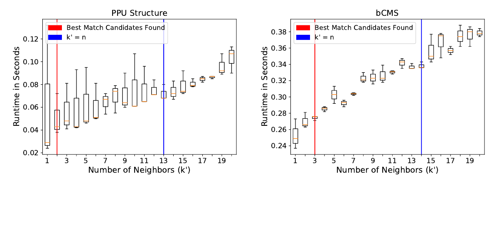

# Installation
Please refer to REQUIREMENTS.md for the requirements of the two different setups.

## Installation - Running the Experiments with Docker
The following installation instructions apply, if you plan to run the experiments presented in our paper __with__ Docker.

### Installation Instructions
In the following, we describe how to build the Docker image and run the experiments in Docker containers.

* First, open a suitable terminal.
```
Windows Command Prompt: 
 - Press 'Windows Key + R' on your keyboard
 - Type in 'cmd' 
 - Click 'OK' or press 'Enter' on your keyboard
 
Windows PowerShell:
 - Open the search bar (Default: 'Windows Key') and search for 'PowerShell'
 - Start the PowerShell
 
Linux:
 - Press 'ctrl + alt + T' on your keyboard
```

* Navigate to RaQuN's root directory using the `cd PATH` command
* Build the Docker image with the provided script
```
Windows Command Prompt: 
  build-docker-image.bat
 
Windows PowerShell:
 .\build-docker-image.bat
 
Linux:
 ./build-docker-image.sh
```

The generated Docker image will have the name `match-experiments`.

### Validation of Correct Installation
We prepared an entry point for the Docker image through which you can validate that the image is working. This validation 
comprises a small subset of the experiments which we present in our paper. 

Running the full validation should take around 30 minutes (+- 15 minutes depending on your system). You can start it by 
calling the experiment script:
```
Windows Command Prompt: 
  experiment.bat validate
 
Windows PowerShell:
 .\experiment.bat validate
 
Linux:
 ./experiment.sh validate
```

You can cancel the process at any time by opening the RaQuN's root directory in a new terminal window and calling:
```
ATTENTION: This will stop the execution of ALL RaQuN docker containers currently running on your system.

Windows Command Prompt: 
  stop-all-experiments.bat
 
Windows PowerShell:
 .\stop-all-experiments.bat
 
Linux:
 ./stop-all-experiments.sh
```

### Expected Output
During the execution, the container will print information about each completed experimental run. This output should look 
_similar_ to this:
```
Running RaQuN on ppu_statem...
Dataset: ppu_statem
#1      RaQuN   --      weight: 164.5778        runtimeTotal: 9.57200   k: 0
tp: 10173       fp: 3516        fn: 1404        precision: 0.743151     recall: 0.878725        f-measure: 0.805272
Number of Models 13     --      Number of Elements: 2884
Number of Tuples: 348   --      Number of Elements in Largest Model: 298
Number of Comparisons Theoretically Needed for a Complete N-Way Comparison: 3814644
Number of Comparisons Actually Performed by the Algorithm: 245216
```
At the same time, each run will save its result in an automatically created folder `./results` in the root directory 
of the project. Once the validation run finished, you can find the generated plots and latex tables under `./results/eval-results`

You can compare the generated plots and tables with the screenshots presented below. Note that they do not show the same
values as presented in our paper, because a large portion of the experimental runs are missing and a different computer 
was used.
#### RQ1 Table

#### RQ2 Plots

#### RQ3 Plots


## Installation - Running the Experiments without Docker
The following installation instructions apply, if you plan to run the experiments presented in our paper __without__ Docker.
```
We encourage you to try out running the experiments using Docker instead. It is easier to run, more robust, and 
you can also quickly run the experiments with a new setup by rebuilding the Docker image.
```

### Installation Instructions
In the following, we describe how to build the required JAR files and how to prepare the experimental subjects.

* First, make sure that all requirements listed in REQUIREMENTS.md are installed
* Open a suitable terminal.
```
Windows Command Prompt: 
 - Press 'Windows Key + R' on your keyboard
 - Type in 'cmd' 
 - Click 'OK' or press 'Enter' on your keyboard
 
Windows PowerShell:
 - Open the search bar (Default: 'Windows Key') and search for 'PowerShell'
 - Start the PowerShell
 
Linux:
 - Press 'ctrl + alt + T' on your keyboard
```
* Navigate to RaQuN's root directory using the `cd PATH` command 
* Make sure that your system is running JDK-11
```
java -version
```
* Build RaQuN with Maven
```
mvn package
```
* Unpack all zip-files inside the `experimental_subjects` and `experimental_subjects/argouml` directory to
  their current location.
  The resulting file structure should look like this:
```
  ${RaQuN}/
    experimental_subjects/
        argouml/
            argouml_p001_s001.csv
            argouml_p001_s002.csv
            ...
            argouml_p095_s030.csv
        Apogames.csv
        argouml.csv
        bcms.csv
        bcs.csv
        example.csv
        hospitals.csv
        ppu.csv
        ppu_statem.csv
        random.csv
        randomLoose.csv
        randomTight.csv
        warehouses.csv
```

### Validation of Correct Installation
We prepared an entry point for the Docker image through which you can validate that the image is working. This validation
comprises a small subset of the experiments which we present in our paper. 

Running the full validation should take around 30 minutes (+- 15 minutes depending on your system). You run it by
calling the experiment JAR files with the corresponding properties:
```
Windows:
    java -jar target\RQ1Runner-jar-with-dependencies.jar docker-resources\quick-validation.properties
    java -jar target\RQ2Runner-jar-with-dependencies.jar docker-resources\quick-validation.properties
    java -jar target\RQ3Runner-jar-with-dependencies.jar docker-resources\quick-validation.properties
Linux:
    java -jar target/RQ1Runner-jar-with-dependencies.jar docker-resources/quick-validation.properties
    java -jar target/RQ2Runner-jar-with-dependencies.jar docker-resources/quick-validation.properties
    java -jar target/RQ3Runner-jar-with-dependencies.jar docker-resources/quick-validation.properties
```

Lastly, you can run the experiment evaluation that generates plots and tables similar to the ones presented in our paper:
```
Windows:
    python.exe .\result_analysis_python\evaluation.py
Linux:
    python3.8 ./result_analysis_python/evaluation.py
```

### Expected Output
See the section for expected output when running the experiments with Docker.